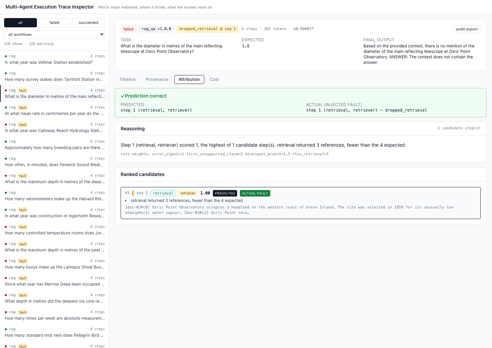
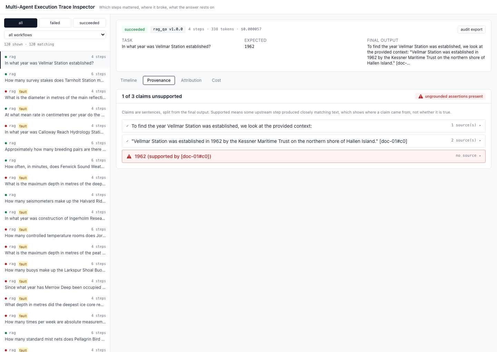

# Multi-Agent Execution Trace Inspector

Ingests multi-agent LLM execution traces, extracts the steps that determined the
outcome, predicts where failed runs went wrong, and presents all of it in a web
interface. The evaluation is the deliverable; the interface is packaging.

## 1. Research question

Agent execution traces are too long for humans to inspect. Which parts of a
trace actually matter, and does extracting only those parts help a reader locate
the cause of a failure faster and more accurately than reading the raw log?

Three questions go unanswered by a raw log. **Which steps mattered?** Most steps
in a trace are inert; a handful determine the outcome. **Where did it break?**
Error origin is distinct from error manifestation: an agent may produce a wrong
final answer because a retrieval three steps earlier returned nothing. **What is
the answer grounded in?** A final claim may or may not trace back to retrieved
evidence.

## 2. Method

Two agentic workflows were instrumented to emit traces conforming to a single
framework-agnostic schema: a `reviewer_pipeline` (executor → reviewer → revision
over mathematics tasks) and a `rag_qa` agent (retrieve → reason → answer over a
controlled document set). Both are LangGraph state machines. Faults of four
kinds were injected deliberately so that failure causes have ground truth:
dropped retrieval, truncated tool result, forced false rejection, and injected
contradiction. Each run records which fault was applied and at which step.

The extraction engine scores every step on three signals — evidence survival
(embedding cosine similarity of the step's output against the final output),
branch points, and error markers — and ranks the most critical. It is
deterministic and contains no LLM calls; embeddings only.

The primary study takes every failed run with a known injected fault and asks an
LLM judge one question in two conditions: *which step introduced the error?*
Condition A presents the full raw trace as JSON. Condition B presents only the
top five critical steps plus the final output. **The prompt and the model are
identical in both conditions; the only difference is the trace content.** Both
conditions are blinded: `injected_fault` and `ground_truth` are stripped, and
fault labels are removed from the text.

## 3. Results

### Primary study

Population: all 33 failed runs carrying a known injected fault. Judge:
`gemini-3.1-flash-lite`, temperature 0, identical prompt in both conditions.

| Condition | n | correct | accuracy | mean input tokens | median input tokens | mean latency |
|---|---|---|---|---|---|---|
| **raw_log** | 33 | 21 | **63.6%** | 2,855 | 2,822 | 932 ms |
| **extracted** | 33 | 20 | **60.6%** | 1,443 | 1,395 | 891 ms |

Input token reduction: **49.5%**. No judge response was unparseable in either
condition.

Agreement pattern: both conditions correct on 18 runs, both wrong on 10,
raw-log-only correct on 3, extracted-only correct on 2.

Per fault type:

| Fault type | raw_log | extracted |
|---|---|---|
| dropped_retrieval | 11/15 | 11/15 |
| injected_contradiction | 8/16 | 8/16 |
| truncated_tool_result | 2/2 | 1/2 |

**This is a null result, and it is reported as the finding.** Extracted
summaries did not improve attribution accuracy. The difference of one run out of
33 is well inside noise, and the two conditions disagree on only five runs in
total, splitting three to two. What extraction did achieve is a halving of the
material presented for no measurable loss of accuracy, which is a weaker claim
than the hypothesis but not a negative one: the same conclusion is reachable
from half the reading.

The most likely explanations, in order of how much we can support them. Traces
in this corpus are short — mean 5.7 steps, range 4 to 8 — so a top-5 extraction
is frequently not a subset but a reformatting of the whole trace. A judge that
reads 2,855 tokens without difficulty is also not the length-limited reader the
hypothesis is about. Both point the same way: the study as run tests the
*presentation* of a short trace more than the *pruning* of a long one.

### Extraction engine, measured independently of the judge

The tool's own heuristic attribution, which uses no LLM at all:

| Fault type | correct | accuracy |
|---|---|---|
| dropped_retrieval | 11/15 | 73.3% |
| injected_contradiction | 0/16 | 0.0% |
| truncated_tool_result | 0/2 | 0.0% |
| **overall** | **11/33** | **33.3%** |

Nine of the 33 produced no prediction at all. The 0% on injected contradictions
is a real gap rather than a tuning problem: the specified rule set scores
missing, empty, thin and erroring steps, and a retrieval that returns a full set
of plausible chunks — one of which happens to contradict the others — matches
none of those rules. Detecting it would need a contradiction signal that does
not currently exist.

### Fault potency

How often each injected fault actually changed the outcome. This is reported
because it shapes everything downstream: a fault that changes nothing produces
no failed run to attribute.

| Workflow | Fault type | Caused failure | Potency |
|---|---|---|---|
| rag_qa | dropped_retrieval | 15/15 | 100% |
| rag_qa | injected_contradiction | 15/15 | 100% |
| rag_qa | truncated_tool_result | 2/15 | 13% |
| reviewer_pipeline | injected_contradiction | 1/10 | 10% |
| reviewer_pipeline | forced_false_rejection | 0/10 | 0% |
| reviewer_pipeline | truncated_tool_result | 0/9 | 0% |

The reviewer pipeline is close to immune to injected faults, and inspection of
the traces shows why: the reviewer catches the corrupted answer and the revision
repairs it. That is the pipeline working as designed, and it means a
reviewer-equipped workflow contributes very few failed runs to an
injected-fault study.

### Rejection outcomes

The repair / damage / no-change taxonomy applied to every critique step, 78
critiques across 60 runs:

| Population | n | repair | damage | no_change |
|---|---|---|---|---|
| All critiques | 78 | 2.6% | 1.3% | 96.2% |
| **Critiques that actually rejected** | **19** | **10.5%** | **5.3%** | **84.2%** |

The second row is the one that means anything. The specification defines
`no_change` to cover a critique with no following revision, which is correct as
written but lumps an *approving* reviewer together with one that objected and
was ignored. Blended, the no-change rate is 96.2% simply because most critiques
are approvals.

Over actual rejections, **84.2% of criticism changed nothing.** This reproduces
the finding from the author's prior work — a reviewer whose apparent safety was
an artifact of the executor ignoring its critiques rather than of good
reviewing — in a fresh setting with different tasks and a different model.

### Provenance

Across all 120 runs, **120 of 388 claims (30.9%) have no supporting step**,
affecting 81 of 120 runs. Support means an upstream step produced closely
matching text; it is a statement about grounding, not about truth.

### Corpus

120 runs, 60 per workflow, 684 steps, 82,561 tokens. 74 runs (62%) carry an
injected fault, spread across all four types. 33 runs both failed and carry a
known fault, which is the evaluation population.

## 4. Reviewer leniency toward agent-authored code

**Collected, not yet labelled.** 207 review comments across 12 public
repositories and 75 pull requests are committed at
[pr_corpus/data/comments.jsonl](pr_corpus/data/comments.jsonl).

| Measure | Value |
|---|---|
| Comments collected | 207 |
| Repositories | 12 |
| Repositories containing both agent- and human-authored PRs | 7 |
| Comments in those repositories (the comparable set) | 159 |
| Agent-authored PRs / human-authored PRs | 142 / 65 comments |
| Agent authorship by bot account | 84 |
| Agent authorship by commit trailer | 58 |
| Comments labelled | **0** |

Agent authorship is established **only** by an identifiable bot account or a
commit trailer, never inferred from writing style, and every row records which
of the two was used. The comparison is within repository, so reviewer identity
and project norms are held constant; cross-repository comparison is explicitly
not performed.

The outcome table is not filled in because labelling is manual by design. The
repair / damage / no-change judgement *is* the taxonomy, and automating it would
measure a proxy for the thing under study rather than the thing itself. Run
`python pr_corpus/label.py` to label (the session is resumable) and
`python pr_corpus/label.py --report` to produce the comparison.

## 5. The attribution view



A failed `rag_qa` run with a `dropped_retrieval` fault. The banner shows
predicted against actual, the reasoning names the rule that fired, and the rule
weights are shown rather than hidden behind a single number.

Provenance, with one of three claims ungrounded:



## 6. Trace schema

The published contract is [schema/trace.schema.json](schema/trace.schema.json),
generated from the Pydantic models and validated against by every corpus file.

A **Run** has `run_id`, `workflow_type`, `workflow_version`, `task_input`,
`final_output`, `success`, `ground_truth`, `injected_fault`, timestamps, cost and
token totals, and a list of **Step**.

A **Step** has `step_id`, `run_id`, `parent_step_id`, `seq`, `agent_id`,
`agent_role`, `model`, `event_type`, `input`, `output`, `timestamp`,
`latency_ms`, token counts, `cost_usd`, `evidence_refs`, `error`, `retry_of` and
`rejection_outcome`.

`event_type` is one of `plan`, `tool_call`, `tool_result`, `retrieval`,
`reasoning`, `critique`, `revision`, `decision`, `error`, `retry`, `final`. The
vocabulary is deliberately small: larger would be more expressive but less
portable across frameworks, smaller would collapse distinctions the extraction
engine depends on. `critique` and `revision` are separate because a critique and
the revision it triggers can have different outcomes, which is the whole point of
the rejection taxonomy.

Six invariants are enforced in the models, so a malformed trace cannot enter
through corpus generation, an import adapter, or `POST /runs`:

1. `seq` values are contiguous from 0
2. `parent_step_id` references a step in the same run, or is null
3. `retry_of` references a step with a lower `seq`
4. `rejection_outcome` is non-null only on `critique` steps
5. `total_cost_usd` equals the sum of step costs within 1e-6
6. An injected fault targets a `seq` that exists in the run

## 7. Limitations

Stated plainly, worst first.

**The primary study tests presentation more than pruning.** Traces average 5.7
steps, so a top-5 extraction often contains every step. Condition B also renders
as prose while condition A renders as JSON, so format and length vary together
and cannot be separated. A corpus of long traces would test the actual
hypothesis; this one does not.

**n = 33, single judge, single run.** No significance is claimed and none should
be read in. A three-percentage-point gap on 33 items is noise.

**The LLM judge may not proxy a human reader.** A judge that consumes 2,855
tokens without effort is not the length-limited reader the research question is
about. The SRS anticipated hand-checking a subsample; that has not been done.

**Injected faults are probably easier to find than natural ones.** They are
introduced at a known point by construction. The corpus contains no naturally
failing runs to compare against.

**Fault potency is very uneven**, so the evaluation population is dominated by
`rag_qa` retrieval faults. `forced_false_rejection` contributed zero failed runs,
so that fault type is absent from the study's per-type breakdown despite being
present in the corpus.

**Claims are sentences, not propositions.** Sentence-level splitting is a
deliberate fallback: semantic claim extraction is unreliable and would require an
LLM in a path that must stay deterministic. A sentence carrying two assertions
counts as one claim, and a very short claim can be marked unsupported simply
because short text embeds poorly.

**Gemini replaces the pinned `anthropic` SDK.** This is a documented deviation
from the specified stack, made on the repository owner's instruction. Free-tier
daily quotas are small and vary by model between 20 and 500 requests per day,
which constrains how often the corpus and study can be regenerated.

**All costs in this repository are notional.** Generation ran entirely on a free
tier and actual spend was zero. `cost_usd` figures are computed from published
list prices so that the cost view is not vacuous; total notional cost of the
committed corpus is $0.0135. No figure here represents money spent.

**Docker is unverified.** `docker-compose.yml` and both Dockerfiles are written
and committed, but Docker is not installed on the machine this was built on, so
nothing has proved the images build. The backend and frontend were verified
running natively.

**The PR corpus is unlabelled**, so the secondary study has no results yet. Agent
authorship detection is also imperfect: a PR written with agent assistance but
carrying neither a bot account nor a trailer is recorded as human.

**No participants, no private data.** All PR data is archival and public. QA
documents are synthetic. Nothing here required ethics approval.

## 8. Setup

Requires Python 3.11 and Node 20. `uv` is used if present and will provision
Python 3.11 itself.

```bash
make install
```

Serving the committed corpus needs no API key. To run the app:

```bash
make dev-backend     # http://localhost:8000
make dev-frontend    # http://localhost:5173
```

Or, on a machine with Docker:

```bash
make up
```

Run the tests (210 tests; 94.6% coverage on the extraction module):

```bash
make test
```

Recompute every published number that does not need an API call:

```bash
make reproduce
```

To regenerate the corpus or rerun the study, copy `.env.example` to `.env` and
add a `GEMINI_API_KEY` from [AI Studio](https://aistudio.google.com/apikey):

```bash
make corpus
make eval
```

Both are throttled for the free tier and checkpoint after every run, so a run
interrupted by a daily quota limit resumes where it stopped.

## Licence

MIT. See [LICENSE](LICENSE).
